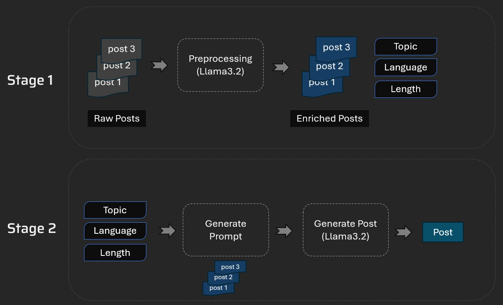

# 🧠 AI-Powered Post Generator

An intelligent content generation tool that helps creators, influencers, and marketers generate high-quality posts based on their past writing style.


## ✨ Overview

This tool analyzes a collection of your previous posts and learns your writing patterns, tone, and commonly used topics. By selecting a topic, desired post length, and preferred language, you can instantly generate a new post that aligns with your historical writing style.

Whether you're a content creator or a brand strategist, this AI assistant helps you scale your content output while staying true to your voice.

---

## 🏗️ Technical Architecture



### How It Works:

1. **Ingest Posts**: The tool parses and stores metadata from your past content (topics, tone, language, and post length).
2. **Few-Shot Prompting**: It selects a few similar past posts as examples to guide the language model (LLM).
3. **Content Generation**: Based on your selected input (topic, length, and language), the model generates a stylistically consistent new post.
---

## ⚙️ Setup Instructions

### 1. 🔑 Get Your API Key

Get your API key from [Groq Console](https://console.groq.com/keys)  
Then, create a `.env` file in your project root and add the following:


GROQ_API_KEY=your_api_key_here


## Set-up
1. To get started we first need to get an API_KEY from here: https://console.groq.com/keys. Inside `.env` update the value of `GROQ_API_KEY` with the API_KEY you created. 
2. To get started, first install the dependencies using:
    ```commandline
     pip install -r requirements.txt
    ```
3. Run the streamlit app:
   ```commandline
   streamlit run main.py
